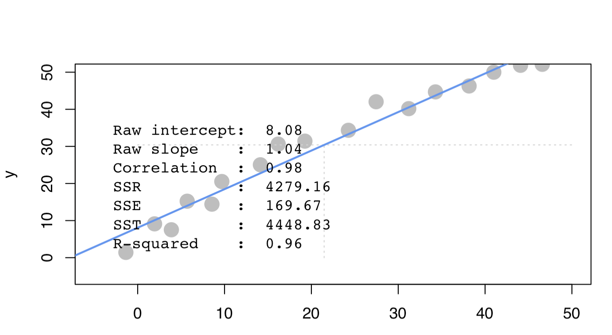
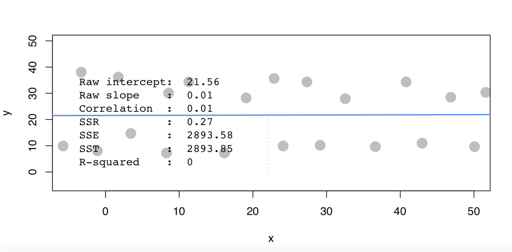

## Set Working Directories & Reading Files
<br>
```{r,message=FALSE,out.width="80%"}
setwd("/Users/olivia/Documents/Documents/Study/Semester 6/BACS/HW10")
programmer <-read.csv("programmer_salaries.txt", sep="\t")
library(ggplot2)
library(dplyr)
```

## QUESTION 1
<br>

#### A) Comparing scenarios 1 and 2, which do we expect to have a stronger R2 ?

\
**Answer** : Scenario 1 will have a stronger $R^2$ , Since data points are narrowly dispersed around a clear and strong trend line , the proportion of variability in y that can be explained by x is likely to be higher. In this case, the linear relationship between x and y is likely to be strong, and the $R^2$ value will reflect this.

#### B) Comparing scenarios 3 and 4, which do we expect to have a stronger R2 ?

\
**Answer** : Scenario 3 will have a stronger $R^2$ , Since the data points are narrowly dispersed around a clear trend line, the linear relationship between x and y are strong. This means that the proportion of variability in y that can be explained by x is still relatively high. As a result, the R2 value is likely to be higher. However, it will result in a decreasing manner since most of the data points are around decreasing regression line.

#### C) Comparing scenarios 1 and 2, which do we expect has bigger/smaller SSE, SSR, and SST? (intuitively)

\
**Answer** : 
\
Scenario 1 will have a bigger SSR as the line is steep and fits the data closely, capturing most of the variance in the data and bigger SST as the line captures most of the variance in the data.
\
Scenario 1 will have a smaller SSE as the errors are minimized due to the close fit to the line.
\
Scenario 2 will have a bigger SSE as the errors are larger due to the greater variability in the data.
\
Scenario 2 will have a smaller SSR and SST as they have a greater variability.


#### D) Comparing scenarios 3 and 4, which do we expect has bigger/smaller SSE, SSR, and SST? (intuitively)

\
**Answer** : 
\
I expect scenario 4 to have a larger SSE and SST a smaller SSR compared to scenario 3.
\
This is because in Scenario 4, the dispersion of points is wider, meaning there is more variability in the data and therefore a larger amount of error in the model.


```{r, echo=FALSE, fig.cap="Scenario1", out.width = '50%'}

```
```{r, echo=FALSE, fig.cap="Scenario2", out.width = '50%'}

```
```{r, echo=FALSE, fig.cap="Scenario3", out.width = '50%'}

```
```{r, echo=FALSE, fig.cap="Scenario4", out.width = '50%'}

```
\newpage

## QUESTION 2
<br>

#### A) Use the lm() function to estimate the regression model Salary ~ Experience + Score + Degree. Show the beta coefficients, R2, and the first 5 values of y  ($fitted.values) and  ($residuals)

```{r pressure, echo=FALSE, fig.cap="A caption", out.width = '30%'}
programmer_regression<- lm(Salary ~ Experience + Score + Degree, data=programmer)
programmer_regression

prog_std<-data.frame(scale(programmer))
prog_regr_std<-lm(Salary ~ Experience + Score, data=programmer)
summary(prog_regr_std)

summary(programmer_regression)
head(programmer_regression$fitted.values,5)
head(programmer_regression$residuals,5)
```

#### B) Use only linear algebra and the geometric view of regression to estimate the regression yourself:

#### 1) Create an X matrix 

\
```{r,message=FALSE,out.width="80%"}
x <- cbind(1, programmer[, c("Experience", "Score", "Degree")])
```

#### 2) Create a y vector with the Salary values

\
```{r,message=FALSE,out.width="80%"}
y <- programmer$Salary
```

#### 3) Compute the beta_hat vector of estimated regression coefficients

\
```{r,message=FALSE,out.width="80%"}
beta_hat <- solve(t(x) %*% as.matrix(x)) %*% t(x) %*% y
beta_hat
```

#### 4) Compute a y_hat vector of estimated y values, and a res vector of residuals 

\
```{r,message=FALSE,out.width="80%"}
y_hat <- as.matrix(x) %*% beta_hat
head(y_hat, 5)

res <- y - y_hat
head(res, 5)
```

#### 5) Using only the results from (i) – (iv), compute SSR, SSE and SST 

\
```{r,message=FALSE,out.width="80%"}
SSR <- sum((y_hat - mean(y))^2)
SSR
SSE <- sum(res^2)
SSE
SST <- sum((y - mean(y))^2)
SST
```

#### C) Compute $R^2$ for in two ways, and confirm you get the same results:

#### 1) Use any combination of SSR, SSE, and SST

\
```{r,message=FALSE,out.width="80%"}
R2_1 <- SSR / SST
R2_1
```

#### 2) Use any combination of SSR, SSE, and SST

\
```{r,message=FALSE,out.width="80%"}
R2_2 <- cor(y, y_hat)^2
R2_2
```

\newpage

## QUESTION 3
<br>

#### A) Let’s first try exploring this data and problem:

```{r,message=FALSE,out.width="80%"}
auto <- read.table("auto-data.txt", header=FALSE, na.strings = "?")
names(auto) <- c("mpg", "cylinders", "displacement", "horsepower", "weight", 
                 "acceleration", "model_year", "origin", "car_name")

```

#### 1) Visualize the data as you wish (report only relevant/interesting plots)

\
```{r,message=FALSE}
par(mfrow = c(2, 4))
plot(auto$mpg ~ auto$cylinders, xlab = "Cylinders", ylab = "MPG")
plot(auto$mpg ~ auto$displacement, xlab = "Displacement", ylab = "MPG")
plot(auto$mpg ~ auto$horsepower, xlab = "Horsepower", ylab = "MPG")
plot(auto$mpg ~ auto$weight, xlab = "Weight", ylab = "MPG")
plot(auto$mpg ~ auto$acceleration, xlab = "Acceleration", ylab = "MPG")
plot(auto$mpg ~ auto$model_year, xlab = "Model Year", ylab = "MPG")
plot(auto$mpg ~ auto$origin, xlab = "Origin", ylab = "MPG")
```

#### 2) Report a correlation table of all variables, rounding to two decimal places

\
```{r,message=FALSE,out.width="80%"}
auto_temp<-auto[1:8]
round(cor(auto_temp,use="pairwise.complete.obs"),2)
```

#### 3) From the visualizations and correlations, which variables appear to relate to mpg?

\
```{r,message=FALSE,out.width="80%"}
auto_temp<-auto[1:8]
round(cor(auto_temp,use="pairwise.complete.obs"),2)
```

From the visualizations and correlations, I think cylinders, displacement, horsepower and weight, model year, and origin appear to relate to mpg

#### 4) Which relationships might not be linear? 
\
**Answer**: I think relationship of cylinder, acceleration, model year and origin with mpg might not be linear.

#### 5) Are there any pairs of independent variables that are highly correlated (r > 0.7)?

1. Cylinders and displacement: r = 0.95
\
2. Weight and displacement: r = 0.93
\
3. Horsepower and displacement: r = 0.90
\
4. Weight and cylinders: r = 0.90
\
5. Horsepower and cylinders: r = 0.84
\
6. Weight and horsepower: r = 0.86

\
```{r,message=FALSE,out.width="80%"}
round(cor(auto_temp,use="pairwise.complete.obs"),2)
```

#### B) Let’s create a linear regression model where mpg is dependent upon all other suitable variables:

#### 1) Which independent variables have a ‘significant’ relationship with mpg at 1% significance?

\
```{r,message=FALSE,out.width="80%"}
autolm <- lm(mpg ~ cylinders + displacement + 
               horsepower+ weight+ acceleration + 
               model_year+ factor(origin), data = auto)
coefficients_table <- data.frame(summary(autolm)$coefficients)
coefficients_table
significant_variables <- coefficients_table[coefficients_table$`Pr...t..` < 0.01,]
significant_variables
```

#### 2) Looking at the coefficients, is it possible to determine which independent variables are the most effective at increasing mpg? If so, which ones, and if not, why not?

\
**Answer**: No, it is not possible to determine which independent variables are the most effective at increasing mpg since all independent variable are not standardized

#### C) Let’s try to resolve some of the issues with our regression model above.

#### 1) Create fully standardized regression results: are these slopes easier to compare?

\
```{r,message=FALSE,out.width="80%"}
auto_sd <- data.frame(auto[1:7])
auto_sd <- scale(auto_sd)
auto_std <- cbind(auto_sd,auto$origin)
colnames(auto_std)[8] ="origin"
auto_std <- data.frame(auto_std)
auto_stdregr <- lm(mpg ~ cylinders + displacement + horsepower+ weight+ acceleration + model_year+ factor(origin), data = auto_std)
summary(auto_stdregr)
```

#### 2) Regress mpg over each nonsignificant independent variable, individually. Which ones become significant when we regress mpg over them individually?

\
The non-significant independent variables at the 1% level are Cylinders,Horsepower,Acceleration

```{r,message=FALSE,out.width="80%"}
lm_cylinder <- lm(mpg ~ cylinders, data = auto_std)
summary(lm_cylinder)

lm_horsepower <- lm(mpg ~ horsepower, data = auto_std)
summary(lm_horsepower)

lm_acceleration <- lm(mpg ~ acceleration, data = auto_std)
summary(lm_acceleration)
```

\
**Answer** : All of them will become become significant when we regress mpg over them individually

#### 3) Plot the distribution of the residuals: are they normally distributed and centered around zero?

\
```{r,message=FALSE,out.width="80%"}
par(mfrow = c(1, 2))
hist(auto_stdregr$residuals, main = "Histogram of Residuals", xlab = "Residuals")
qqnorm(auto_stdregr$residuals, main = "Normal Probability Plot of Residuals")
qqline(auto_stdregr$residuals)
```

The data is normally distributed and centered around zero
