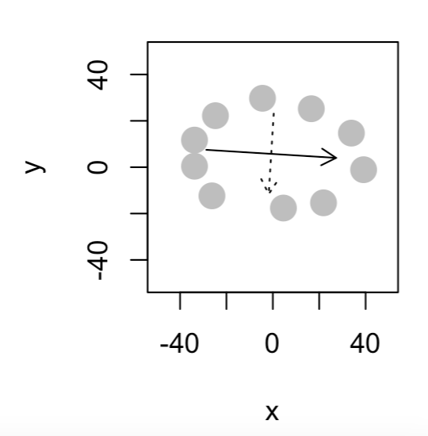
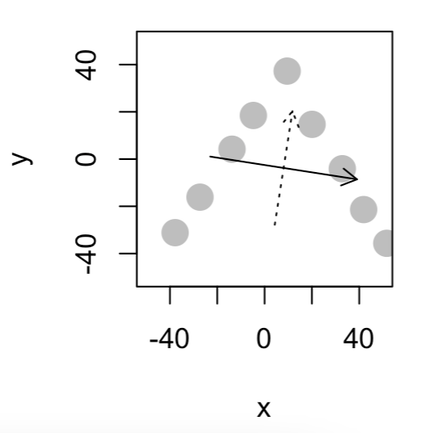

## Set Working Directories & Reading Files
<br>

```{r,message=FALSE,out.width="80%"}
setwd("/Users/olivia/Documents/Documents/Study/Semester 6/BACS/HW13")
library(readxl)
cars<-read.table("auto-data.txt", header=FALSE, na.strings = "?")
names(cars) <- c("mpg", "cylinders", "displacement", "horsepower", "weight", 
                 "acceleration", "model_year", "origin", "car_name")
cars_log <- with(cars, data.frame(log(mpg), log(cylinders), log(displacement), log(horsepower), 
                                  log(weight), log(acceleration), model_year, origin))
cars_log <- na.omit(cars_log)
```

## QUESTION 1
<br>

#### A) Let’s analyze the principal components of the four collinear variables

#### 1) Create a new data.frame of the four log-transformed variables with high multicollinearity

\
```{r,message=FALSE,out.width="80%"}
log_collinear <- with(cars_log, data.frame(log.cylinders., log.displacement., 
                                           log.horsepower., log.weight.))
head(log_collinear)
```

#### 2) How much variance of the four variables is explained by their first principal component?

\
```{r,message=FALSE,out.width="60%"}
eigenvalues <- eigen(cov(log_collinear))
variance_explained <- eigenvalues$values / sum(eigenvalues$values)
variance_explained
```

#### 3) Looking at the values and valence (positiveness/negativeness) of the first principal component’s eigenvector, what would you call the information captured by this component?

\
```{r,message=FALSE,out.width="60%"}
first <- eigenvalues$vectors
rownames(first) = c("log.cylinders","log.displacement","log.horsepower","log.weight")
colnames(first) = c("PC1","PC2","PC3","PC4")
first
```

\
**Answer** : PC1 captures the variation in the data related to the overall size or magnitude of the variables. 

#### B) Let’s revisit our regression analysis on cars_log:

#### 1) Store the scores of the first principal component as a new column of cars_log

\
```{r,message=FALSE,out.width="80%"}
cars_pca <- prcomp(log_collinear)
cars_log$scores <- cars_pca$x
head(cars_log$scores)
```

#### 2) Regress mpg over the column with PC1 scores (replacing cylinders, displacement, horsepower, and weight), as well as acceleration, model_year and origin

\
```{r,message=FALSE,out.width="60%"}
summary(lm(log.mpg.~ cars_log$scores[,"PC1"]+log.acceleration. + model_year 
           + factor(origin),data = cars_log))
```

#### 3) Try running the regression again over the same independent variables, but this time with everything standardized.

\
```{r,message=FALSE,out.width="60%"}
cars_log_standardized <- data.frame(scale(cars_log))
regression_model_standardized <- lm(log.mpg. ~ cars_log$scores[,"PC1"] + log.acceleration. + 
                                      model_year + factor(origin), 
                                    data = cars_log_standardized)
summary(regression_model_standardized)
```


#### How important is this new column relative to other columns?

\
```{r,message=FALSE,out.width="60%"}
cor_matrix <- cor(cars_log_standardized)
pc1_correlation <- cor_matrix[9,]
pc1_correlation
```
\newpage

## QUESTION 2
<br>

#### A) How much variance did each extracted factor explain?

\
```{r,message=FALSE,out.width="80%"}
security <- read_excel("security_questions.xlsx",sheet = "data")
pca2 <- prcomp(security,scale. = TRUE)
summary(pca2)$importance[2,]
```

#### B) How many dimensions would you retain, according to the two criteria we discussed? (Eigenvalue >= 1 and Scree Plot – can you show the screeplot with eigenvalue=1 threshhold?) 

\
```{r,message=FALSE,out.width="60%"}
eigenvalues2 <- eigen(cor(security))
eigenvalues2$values
num_dimensions_eigenvalue <- sum(eigenvalues2$values >= 1)
num_dimensions_eigenvalue

screeplot(pca2, type="lines")
```
\
**Answer** : From the above, I would retain 3 dimensions

\newpage

#### C) Can you interpret what any of the principal components mean? Try guessing the meaning of the first two or three PCs looking at the PC-vs-variable matrix

\
**Answer** : In general, a principal component is a linear combination of the original variables in a dataset. It is calculated in such a way that it captures the maximum amount of variation or information present in the data. I think the first principal component captures the most significant source of variation in the data.

\newpage

## QUESTION 3
<br>

#### A) Create an oval shaped scatter plot of points that stretches in two directions 

\


#### B) Can you create a scatterplot whose principal component vectors do NOT seem to match the major directions of variance?

\
