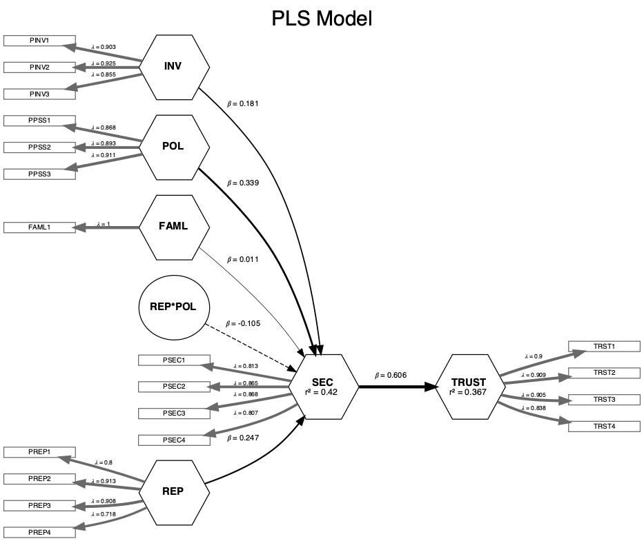

## Set Working Directories & Reading Files
<br>

```{r ,message=FALSE,out.width="80%"}
library(seminr)
library(DiagrammeR)
setwd("/Users/olivia/Documents/Documents/Study/Semester 6/BACS/HW15")
security <- read.csv("security_data_sem.csv")
```

## QUESTION 1

### A) Create a PLS path model using SEMinR, with all the following characteristics:

### I) Measurement model – all constructs are measured as composites:
```{r ,message=FALSE,out.width="80%"}
security_mm <- constructs(
  composite("REP", multi_items("PREP", 1:4)),
  composite("INV", multi_items("PINV", 1:3)),
  composite("SEC", multi_items("PSEC", 1:4)),
  composite("TRUST", multi_items("TRST", 1:4)),
  composite("POL", multi_items("PPSS", 1:3)),
  composite("FAML",single_item("FAML1")),
  interaction_term(iv = 'REP', moderator = 'POL', method = orthogonal)
)
```


### II) Structural Model – paths between constructs as shown in this causal model:
```{r ,message=FALSE,out.width="80%"}
security_sm <- relationships(
  paths(from = c("REP", "INV","POL","FAML","REP*POL"), to = "SEC"),
  paths(from = "SEC", to = "TRUST")
)
```

### B) Show us the following results in table or figure formats:

### I) Plot a figure of the estimated model

```{r ,message=FALSE,out.width="80%",fig.align = "center"}
security_pls <- estimate_pls(data = security,
                        measurement_model = security_mm,
                        structural_model = security_sm)
sec_report<-summary(security_pls)
```


### II) Weights and loadings of composites

```{r ,message=FALSE,out.width="80%"}
sec_report$weights
sec_report$loadings
```

### III) Regression coefficients of paths between factors

```{r ,message=FALSE,out.width="80%"}
sec_report$paths
```

### IV) Bootstrapped path coefficients: t-values, 95% CI

```{r ,message=FALSE,out.width="80%"}
boot_pls <- bootstrap_model(security_pls, nboot = 1000)
summary(boot_pls)
```

\newpage

## QUESTION 2

### A) Create a common factor model using SEMinR, with the following characteristics:

### I) Either respecify all the constructs as being reflective(), or use the as.reflective() function to convert your earlier measurement model to being entirely reflective.

```{r ,message=FALSE,out.width="80%"}
security_cf_mm <- constructs(
  reflective("REP", multi_items("PREP", 1:4)),
  reflective("INV", multi_items("PINV", 1:3)),
  reflective("SEC", multi_items("PSEC", 1:4)),
  reflective("TRUST", multi_items("TRST", 1:4)),
  reflective("POL", multi_items("PPSS", 1:3)),
  reflective("FAML",single_item("FAML1")),
  interaction_term(iv = 'REP', moderator = 'POL', method = orthogonal)
)
```

### II) Use the same structural model as before (you can just reuse it again!)

```{r ,message=FALSE,out.width="80%"}
security_cf_sm <- relationships(
  paths(from = c("REP", "INV","POL","FAML","REP*POL"), to = "SEC"),
  paths(from = "SEC", to = "TRUST")
)
```

### B) Show us the following results in table or figure formats

### I) Plot a figure of the estimated model (it will look different from your PLS model!)

```{r ,message=FALSE,out.width="80%",fig.align = "center"}
security_cf_pls <- estimate_cbsem(data = security,
                             measurement_model = security_cf_mm,
                             structural_model = security_cf_sm)
sec_cf_report<-summary(security_cf_pls)
plot(security_cf_pls,title = "CF PLS Model")
```

### II) Loadings of composites

```{r ,message=FALSE,out.width="80%"}
sec_cf_report$loadings
```

### III) Regression coefficients of paths between factors, and their p-values

```{r ,message=FALSE,out.width="80%"}
sec_cf_report$paths[1:2]
```

