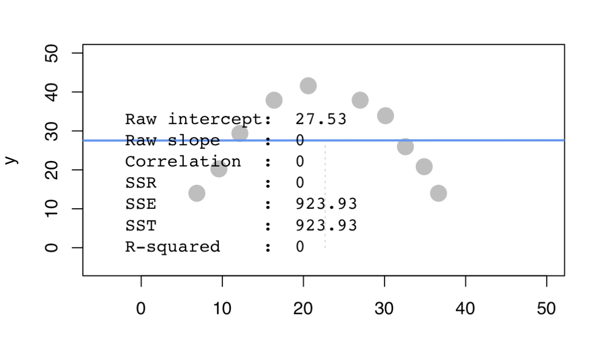
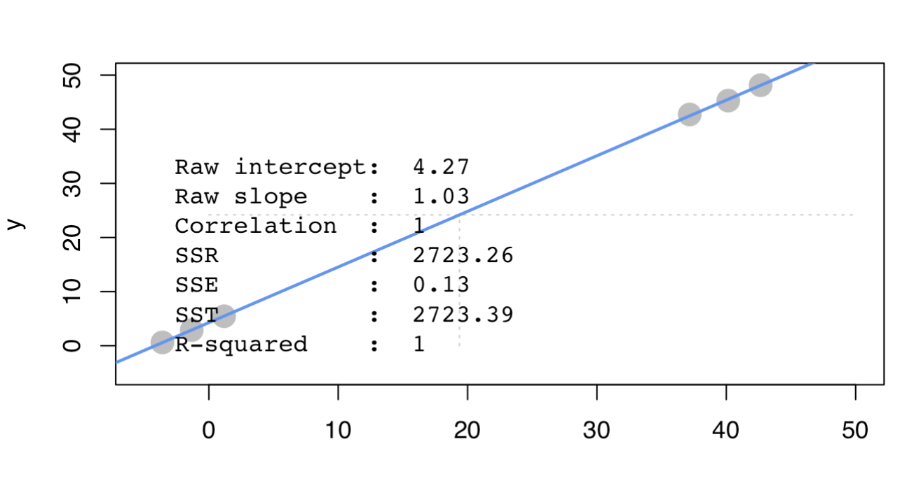
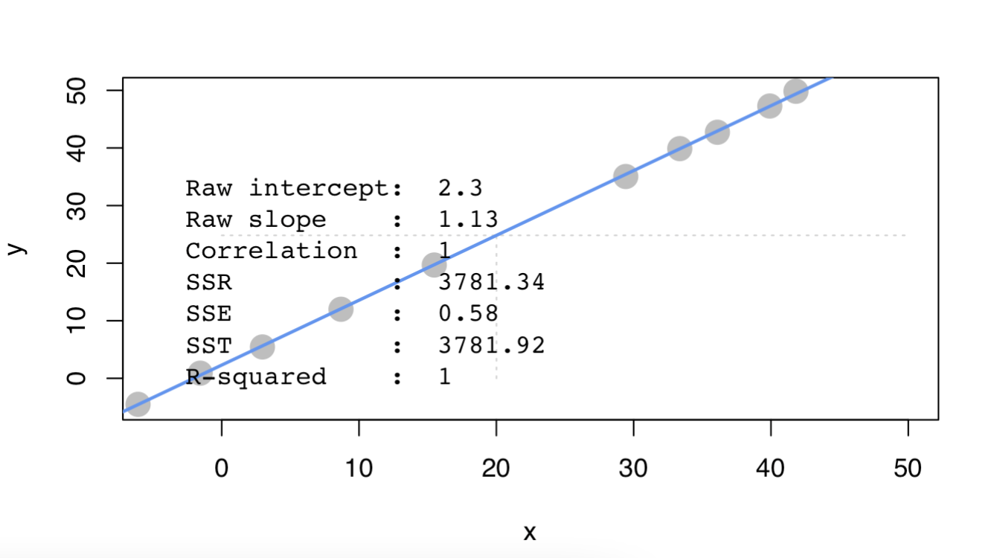

## Set Working Directories & Reading Files
<br>
```{r,message=FALSE,out.width="80%"}
library(data.table)
library(lsa)
library(knitr)
setwd("/Users/olivia/Documents/Documents/Study/Semester 6/BACS/HW9")
ac_bundles_dt <- fread("piccollage_accounts_bundles.csv")
ac_bundles_matrix <- as.matrix(ac_bundles_dt[, -1, with=FALSE])
```


## QUESTION 1
<br>

#### A) Let’s explore to see if any sticker bundles seem intuitively similar:
#### i) How many recommendations does each bundle have?
\
\
**Answer** : Six recommendations for each bundles
```{r pressure, echo=FALSE, fig.cap="A caption", out.width = '30%'}

```

#### ii) Find a single sticker bundle that is both in our limited data set and also in the app’s Sticker Store (e.g., “sweetmothersday”). Then, use your intuition to recommend (guess!) five other bundles in our dataset that might have similar usage patterns as this bundle.
\

**Answer** : Based on my intuition I think "bestdaddy", "Mom2013", "toMomwithLove", "Dad2013", "superherodad2" might have similar usage patterns as "sweetmothersday" bundle.


#### B) Let’s find similar bundles using geometric models of similarity :

#### i) Let’s create cosine similarity based recommendations for all bundles:

1) Create a matrix or data.frame of the top 5 recommendations for all bundles
\
2) Create a new function that automates the above functionality: it should take an accounts-bundles matrix as a parameter, and return a data object with the top 5 recommendations for each bundle in our data set, using cosine similarity.
```{r,message=FALSE,out.width="80%"}
recom_cos <- function(ac_bundles_matrix){  
  # Get the cosine similarity matrix
  sim_matrix <- cosine(ac_bundles_matrix)
  diag(sim_matrix)<-2
  recommendations <- matrix(NA, nrow = ncol(sim_matrix), ncol = 5)
  recommendations <- as.data.frame(recommendations)
  for (i in 1:ncol(sim_matrix)) {
    similar <- order(sim_matrix[, i], decreasing = TRUE)[2:6]
    id <- rownames(sim_matrix)[similar]
    recommendations[i,] <- id
  }
  colnames(recommendations) <- c("1st","2nd","3rd","4th","5th")
  recommendations$Bundle_Name <- rownames(sim_matrix)
  return(recommendations)
}
```

3) What are the top 5 recommendations for the bundle you chose to explore earlier?
```{r,message=FALSE,out.width="80%"}
recom_cos(ac_bundles_matrix)[76,]
```

#### ii) Let’s create correlation based recommendations:

1) Reuse the function you created above (don’t change it; don’t use the cor() function)
\
2) But this time give the function an accounts-bundles matrix where each bundle (column) has already been mean-centered in advance.
```{r,message=FALSE,out.width="80%"}
bundle_means <- apply(ac_bundles_matrix, 2, mean)
bundle_means_matrix <- t(replicate(nrow(ac_bundles_matrix), bundle_means))
ac_bundles_mc_b <- ac_bundles_matrix - bundle_means_matrix
```

3) Now what are the top 5 recommendations for the bundle you chose to explore earlier?
```{r,message=FALSE,out.width="80%"}
recom_cor <- recom_cos(ac_bundles_mc_b)[76,]
recom_cor
```

#### iii) Let’s create adjusted-cosine based recommendations :

1) Reuse the function you created above (you should not have to change it)
\
2) But this time give the function an accounts-bundles matrix where each account (row) has already been mean-centered in advance.
```{r,message=FALSE,out.width="80%"}
bundle_means<-apply(ac_bundles_matrix, 1, mean)
account_means_matrix<-replicate(ncol(ac_bundles_matrix), bundle_means)
ac_bundles_mc_ac<-ac_bundles_matrix-account_means_matrix
```

3) What are the top 5 recommendations for the bundle you chose to explore earlier?
```{r,message=FALSE,out.width="80%"}
recom_cor <- recom_cos(ac_bundles_mc_ac)[76,]
recom_cor
```

#### C) (not graded) Are the three sets of geometric recommendations similar in nature (theme/keywords) to the recommendations you picked earlier using your intuition alone? 
\
**Answer** : The three sets of geometric recommends similar theme for "sweetmothersday"

#### What reasons might explain why your computational geometric recommendation models produce different results from your intuition?
\
**Answer** : I think it is because I choose the theme only because they have a similar keyword

#### D) (not graded) What do you think is the conceptual difference in cosine similarity, correlation, and adjusted-cosine?
\
**Answer** : 
\
1) Cosine Similarity is a measure of similarity between two non-zero vectors defined in an inner product space
\
2) Correlation is a statistical measure that expresses the extent to which two variables are linearly related
\
3) Adjusted Cosine Similarity is a modified form of vector-based similarity where we take into the fact that different users have different ratings schemes

\newpage
## QUESTION 2
<br>

#### A) Scenario A: Create a horizontal set of random points, with a relatively narrow but flat distribution.

#### i) What raw slope of x and y would you generally expect?
\
**Answer** : I expect a raw slope of x and y to be close to 0
\

#### ii) What is the correlation of x and y that you would generally expect?
\
**Answer** : The correlation of x and y would generally be close to 0 if the horizontal set of random points has a relatively narrow but flat distribution.

#### B) Scenario B: Create a random set of points to fill the entire plotting area, along both x-axis and y-axis

#### i) What raw slope of the x and y would you generally expect?
\
**Answer** : I expect a raw slope of x and y to be close to 0, because the points are randomly distributed across the entire plotting area and there is no significant linear relationship between the X and Y variables.
\

#### ii) What is the correlation of x and y that you would generally expect?
\
**Answer** : The correlation of x and y would generally be close to 0, because the points are randomly distributed across the entire plotting area without any discernible pattern which indicates that there is little to no linear relationship between X and Y.

#### C) Scenario C: Create a diagonal set of random points trending upwards at 45 degrees

#### i) What raw slope of the x and y would you generally expect? (note that x, y have the same scale)
\
**Answer** : I expect a raw slope of x and y to be close to 1, since X and Y are increasing at the same rate.
\

#### ii) What is the correlation of x and y that you would generally expect?
\
**Answer** : The correlation of x and y would generally be close to 1. This is because the points are distributed along a straight line at a 45-degree angle, indicating a strong positive linear relationship between X and Y. A correlation coefficient of 1 indicates a perfect positive linear relationship.

#### D) Scenario D: Create a diagonal set of random trending downwards at 45 degrees

#### i) What raw slope of the x and y would you generally expect? (note that x, y have the same scale)
\
**Answer** : I expect a raw slope of x and y to be close to -1, since X and Y are changing in opposite directions at the same rate.
\

#### ii) What is the correlation of x and y that you would generally expect?
\
**Answer** : The correlation of x and y would generally be close to -1. In this case, since the points are distributed along a diagonal line trending downwards at 45 degrees, we should expect the correlation coefficient to be close to -1

#### E) Apart from any of the above scenarios, find another pattern of data points with no correlation (r $\approx$ 0). (can create a pattern that visually suggests a strong relationship but produces r $\approx$ 0?)
\
```{r , echo=FALSE, fig.cap="r = 0", out.width = '100%'}

```
\newpage

#### F) Apart from any of the above scenarios, find another pattern of data points with perfect correlation (r $\approx$ 1).
(can you find a scenario where the pattern visually suggests a different relationship?)
\

```{r , echo=FALSE, fig.cap="r = 1", out.width = '100%'}

```

#### G) Let’s see how correlation relates to simple regression, by simulating any linear relationship you wish:

#### i) Run the simulation and record the points you create: pts <- interactive_regression() 
(simulate either a positive or negative relationship)

```{r,message=FALSE,out.width="80%"}
points <- data.frame (
  x = c (-6.093914,-1.564684,2.964546,8.685679,15.479524,
         29.424785,33.358064,36.099440,39.913528, 41.820573),
  y = c (-4.5121142, 0.8950023, 5.4483635,11.9938203, 19.6776174, 
         35.0452115, 39.8831579, 42.7290086, 47.2823699, 49.8436356)
)
```
\
```{r , echo=FALSE, fig.cap="figure (i)", out.width = '100%'}

```

\newpage

#### ii) Use the lm() function to estimate the regression intercept and slope of pts to ensure they are the same as the values reported in the simulation plot
\
```{r,message=FALSE,out.width="80%"}
summary(lm(points$y ~ points$x))
```

**Answer** : Both of intercept and slope are the same as the values reported in the simulation plot

#### iii) Estimate the correlation of x and y to see it is the same as reported in the plot
\
```{r,message=FALSE,out.width="80%"}
cor(points)
```
\
**Answer** : Yes, the correlation is same as reported in the plot.

#### iv) Now, standardize the values of both x and y from pts and re-estimate the regression slope
\
```{r,message=FALSE,out.width="80%"}
points_std <- data.frame (x = scale(points$x), y = scale(points$y))
summary(lm(points_std$y ~ points_std$x))
cor(points_std)
```
\newpage 

#### v) What is the relationship between correlation and the standardized simple-regression estimates?
\
**Answer** : 
\
The standardized simple-regression’s intercept is approximate to 0 
\
The correlation is approximate to 1
\
When both the predictor and response variables are standardized, the standardized regression coefficient is equal to the correlation coefficient.

